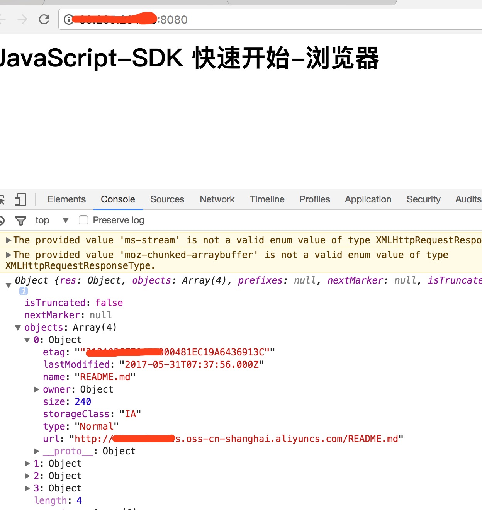
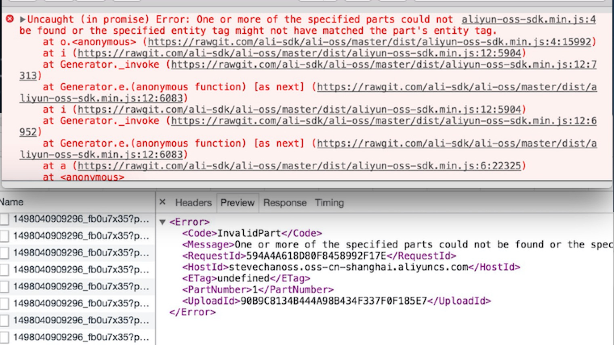

# aliyun-oss-clj: 阿里云OSS的Clojure SDK封装

* 阿里云生成STS临时的id和key访问阿里云OSS

## Usage

* project.clj & youns.clj
```clojure
;; project.clj
[aliyun-oss-clj "0.1.2-SNAPSHOT"]
;; your ns
(ns test (:require [aliyun-oss-clj.core :as sts]))
```
* 生成STS临时的访问身份信息 
```clojure
(let [client (sts/create-client {:region            "cn-shanghai"
                             :access-key-id     "<access-key-id>"
                             :access-key-secret "<access-key-secret>"})]
  (sts/get-assumed-role-creds
    client
    {:role-arn          "<role-arn>"
     :role-session-name "<role-session-name>"
     :policy-map        {:Version   "1"
                         :Statement [{:Action   ["oss:*"]
                                      :Resource ["acs:oss:*:*:*"]
                                      :Effect   "Allow"}]}}))
```
* 将上一步生成STS临时的访问身份信息, 填入对应的oss的调用参数中 (Clojure的示例)

```clojure
(ns test-oss (:require [aliyun-oss-clj.oss :as oss]))

(let [client (oss/create-client {:endpoint          "http://oss-cn-shanghai.aliyuncs.com"
                             :access-key-id     "<access-key-id>" ;; 临时的sts生成的id
                             :access-key-secret "<access-key-secret>" ;; 临时的sts生成的key
                             :sts-token         "<sts-token>"}) ;; 临时的sts生成的token
      bucket-name "<bucket-name>"]
  [(oss/has-bucket-name? client bucket-name)
   (oss/get-bucket-info client bucket-name)
   (oss/upload-file client bucket-name "test1.txt" (.getBytes "hello, world"))])
```

* 将上一步生成STS临时的访问身份信息, 填入对应的oss的调用参数中 (Node的示例)

```node
var oss = require('ali-oss');
var co = require('co');
var store = oss({
    accessKeyId: 'STS.GkRjtzZEaaaaaaaaaaaaaa',  //临时STS生成的accessKeyId
    accessKeySecret: '5oqY7nPCUFWiYbbbbbbbbbbbbb',  //临时STS生成的accessKeySecret 
    bucket: 'stevechanoss',
    region: 'oss-cn-shanghai',
    stsToken: 'CAIShQJ1q6Ft5B2cccccccccccccccccc5R2WaeU2i6yIUo1h4Cuix1xtE5GA==' // 临时STS生成的 stsToken
});

co(function* () {
    var result = yield store.listBuckets();
    console.log(result);
    var result = yield store.listBuckets({
        prefix: 'prefix'
    });
    console.log(result);
}
  ).catch(function (err) {
      console.log(err);
  });

```
* 将上一步生成STS临时的访问身份信息, 填入对应的oss的调用参数中 (js网页的示例)

```html

<h1> JavaScript-SDK 快速开始-浏览器 </h1>
<script src="http://gosspublic.alicdn.com/aliyun-oss-sdk-4.4.4.min.js"></script>

<script type="text/javascript">
  var client = new OSS.Wrapper({
    region: 'oss-cn-shanghai',
    accessKeyId: 'STS.GkRjtzZEaaaaaaaaaaaaaa',
    accessKeySecret: '5oqY7nPCUFWiYbbbbbbbbbbbbb',
    stsToken: 'CAIShQJ1q6Ft5B2cccccccccccccccccc5R2WaeU2i6yIUo1h4Cuix1xtE5GA==',
    bucket: 'stevechanoss'
  });
  client.list({
    'max-keys': 10
  }).then(function (result) {
    console.log(result);
  }).catch(function (err) {
    console.log(err);
  });
</script>

```

*网页调用需要先到阿里云的OSS控制台设置: 允许跨域设置*


网页调用效果:



* `ETag` 设置,允许大文件的上传,如100k以上



阿里云设置`Expose Header`


## License

Copyright © 2017 FIXME

Distributed under the Eclipse Public License either version 1.0 or (at
your option) any later version.
